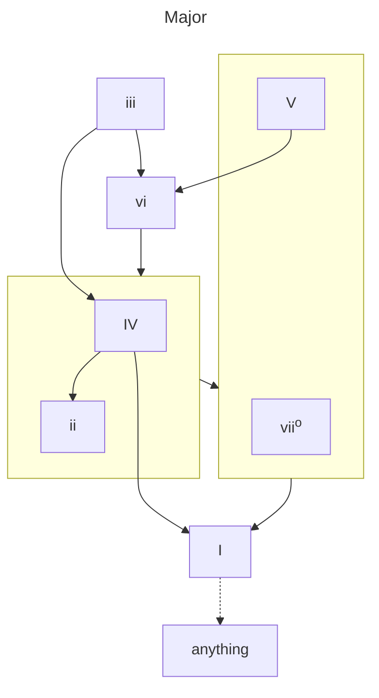
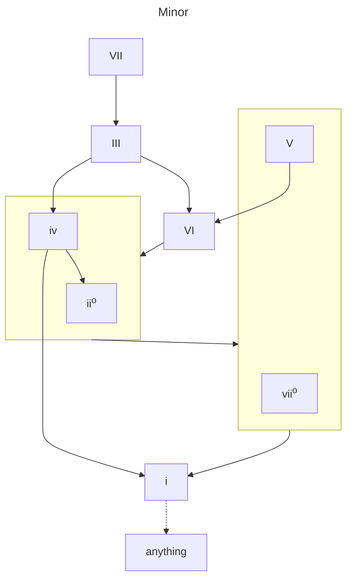

#MusicTheory
$I\rightarrow ii\rightarrow V\rightarrow I$ is common, along with $I\rightarrow IV\rightarrow V\rightarrow I$

```mermaid
---
title: Major
---
graph TD;
	viio["vii<sup>o</sup>"]
	iii --> vi;
	subgraph a[" "]
		IV;
		ii;
	end
	subgraph b[" "]
		viio
		V
	end
	vi --> a --> b --> I;
	
	V --> vi;
	iii --> IV --> I;
	IV --> ii;
	
	I -.-> anything;
```

```mermaid
---
title: Minor
---
graph TD;
	viio["vii<sup>o</sup>"];
	iio["ii<sup>o</sup>"];
	subgraph a[" "]
		iv
		iio
	end
	subgraph b[" "]
		viio
		V
	end
	VII --> III --> VI --> a --> b --> i;
	III --> iv --> i;
	iv --> iio;
	V --> VI;
	i -.-> anything;
```
