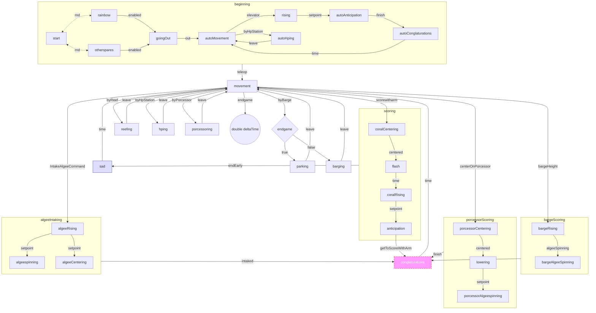

States:
	Game:
		Disabled
		Auto
		Teleop
		Endgame
	Everything In
	Started
	Elevator:
		Low
		L2
		L3
		L4
		Barge
	CoralArm:
		ninetyish
		onethirtyfive
		in
	AlgeeArm:
		up
		high
		low
	Algee wheel spinning (speed?)
	PositionStates:
		near reef
		near hp station
		near porcessor
		near barge
		Parking?
	Centering:
		Reef spot?
		Coral
		Algee
		Porcessor
	Limelight:
		Seeing things
		Num things?
		What things?
	Robot speed or accel
	add up all pid errors

